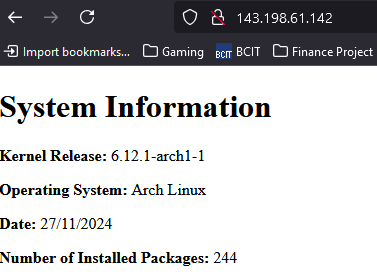

# The One Script
### This script will: 
#### 1) Set up an nginx web server displaying a static html page containing:

- Kernel Release
- Operating System
- Date
- Number of Installed Packages

Note: This html page updates the first time the script is run, and then every day at 5 am.


#### 2) Configure a ufw firewall that only allows http and ssh traffic (ssh rate limiting enabled).

## Requirements
* The script must be run with sudo or as root.


## Running the script
Once this repository has been transferred to your machine you may choose to run the command to start the script from within the same directory as the script, or from a different directory.

Example 1: Running the script from within the same directory.
```
sudo ./the_one_script
```

Example 2: Running the script from a different directory.
- ie. If you have cloned this repository into /home/arch/server-start, and you want to run the script without navigating to that folder,you could run the following command:
```
sudo /home/arch/server-start/the_one_script
```


### General Notes From Development Process

* The web server will be set up on port 80, the firewal will allow all outgoing traffic but deny all incoming except for ssh (limited) and http traffic. If these don't suit your purposes you will need to edit the server block in "system-info.conf" to switch the server port, and change the firefall commands in "the_one_script" (ufw allow <traffic type>).

* The timer that changes how often the index.html file is refreshed is in generate-index.timer, the OnCalendar setting of *-*-* 05:00 means it will run every day at 5am. This may be modified to your desired update frequency.

* A useful command to both start and enable a service:
```
sudo systemctl enable --now <service-file-name-here>
```

* You can check the status of your firewall with:
```
sudo ufw status verbose
```

* To manually allow another port or service through firewall:
```
sudo ufw allow <port-or-service-here>
```

* To remove a port or service from firewall access:
```
sudo ufw delete allow <port-or-service-here>
```

* If you edit your nginx configuration file you can validate it was written correctly with:
```
sudo nginx -t
```

* When writing a script that moves a file into a new location and then attempts to run it, make sure to order the commands in your script properly to avoid wasting time wondering why the file isn't being run.

* You were working with Kernel Release: 6.12.1-arch1-1 when writing this script.

